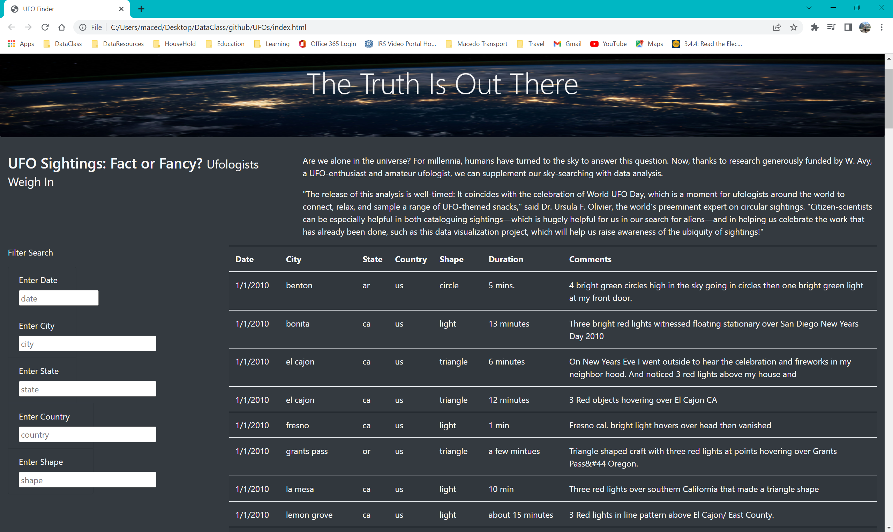
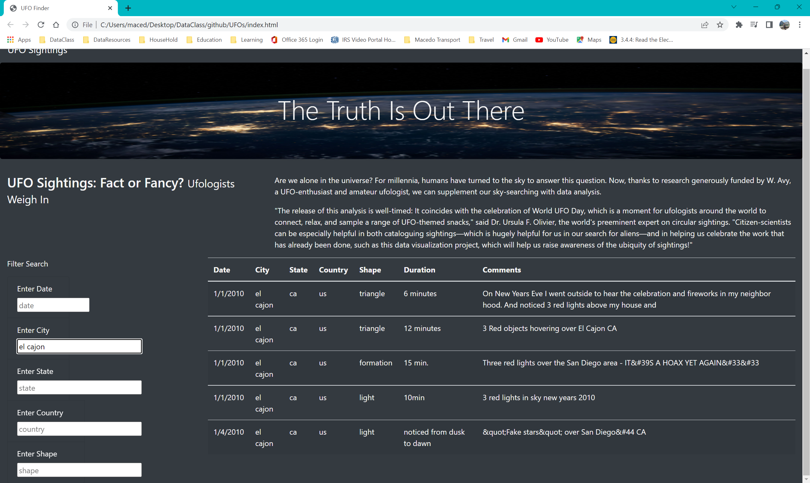

# UFO Sightings Analysis

## Overview of Project
The purpose of this UFO Sightings Analysis is to provide users with more filter options to get an in-depth search for desired data. 

## Results
The UFO Sighting website, displayed below, was created using HTML, CSS, and Javascript. The Filter Search to the left of the webpage is very user-friendly. There are filters that enables the user to enter five different criteria to narrow down the search. The five filter searches are date, city, state, country, and shape.

The user can simply type in one or all criteria in the filter and press enter. The function will filter through the data and provide specified data entered into the search filter.

For example, a user typed 'El Cajon' into the City filter search, then pressed enter. The search results then generated the information for El Cajon UFO Sightings, as can be seen in the image below.

## Summary
In this analysis project, a search filter was successfully created to generate multiple search criteria. However, it is typical that setbacks or insight for improvement may arise during the process of created a project. A possible setback that a user might experience with this webpage is there is not a filter for time or time of day. The recommendations that would improve this webpage are to add a time or time of day filter. Also, another recommendation that would further imporve this webpage are links to images or videos of the sightings.